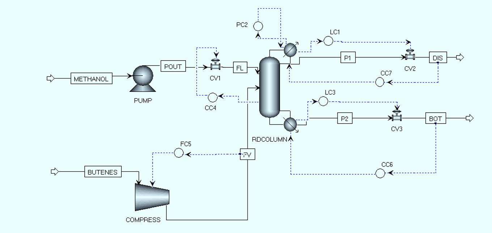

# Aspen Dynamics Simulation

## Process

Dynamic simulation of the Methyl Tert-Butyl Ether (MTBE) reactive distillation process.

## Software

- Aspen Plus V14
- Aspen Dynamics V14

## Description

The steady-state Aspen Plus model was exported to Aspen Dynamics and converted into a dynamic model.

Several control loops were implemented to maintain process stability during transient operation.

The dynamic simulation was used to generate time-series data for developing and validating deep learning soft sensors.

Implemented control loops include:

- Feed flow control
- Column pressure control
- Condenser level control
- Reboiler level control
- Product flow control

## Process Control Diagram

