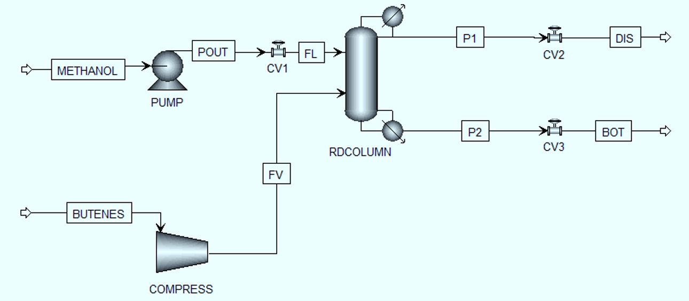

# Aspen Plus Simulation

## Process
Simulation of Methyl Tert-Butyl Ether (MTBE) synthesis using a Reactive Distillation Column.

## Software
- Aspen Plus V14

## Description
This steady-state simulation was developed to generate the operating data required for soft sensor development.

The simulation includes:

- Feed streams
- Reactive distillation column
- Condenser
- Reboiler
- Product streams

## Process Flow Diagram

