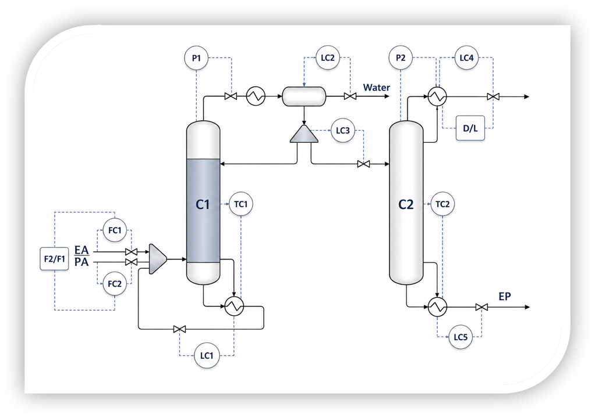

# Aspen Dynamics Simulation

## Process

Dynamic simulation of the Ethyl Propionate reactive distillation process.

## Software

- Aspen Plus V14
- Aspen Dynamics V14

## Description

The steady-state Aspen Plus model was successfully exported to Aspen Dynamics and converted into a dynamic simulation.

Several control loops were implemented to ensure stable operation under transient conditions.

The generated dynamic process data were used for developing and validating advanced deep learning-based soft sensor models.

Implemented control loops include:

- Feed flow control
- Column pressure control
- Condenser level control
- Reboiler level control
- Product flow control

## Process Control Diagram

