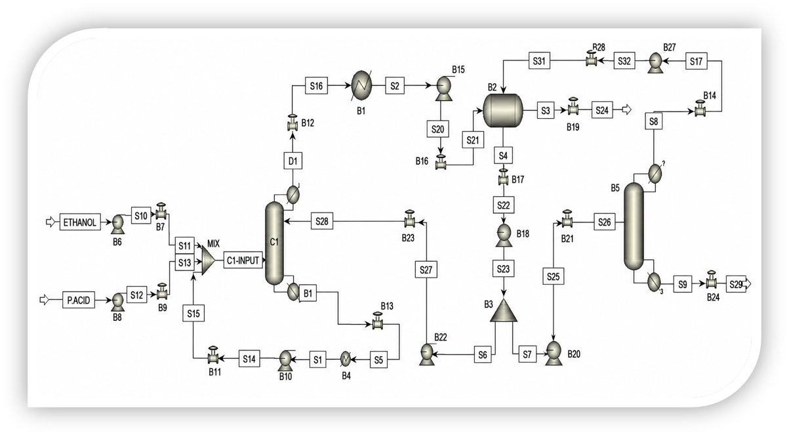

# Aspen Plus Simulation

## Process

Steady-state simulation of the Ethyl Propionate synthesis process using a Reactive Distillation Column.

## Software

- Aspen Plus V14

## Description

This steady-state simulation was developed to model the reactive distillation process for Ethyl Propionate production.

The simulation was used to establish process operating conditions and generate the initial process data required for dynamic simulation and soft sensor development.

The simulation includes:

- Feed streams
- Reactive distillation column
- Condenser
- Reboiler
- Product streams

## Process Flow Diagram

